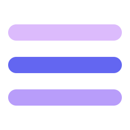

# Vibe Process Bar

<p align="center">
  
</p>

<p align="center">
  <strong>Visualize AI Coding Agent's Workflow at a Glance</strong>
</p>

<p align="center">
  A desktop floating progress bar designed for AI-assisted programming, visualizing AI Agent's working status in real-time.
</p>

<p align="center">
  
  
  
</p>

---

## Why Vibe Process Bar?

When using AI coding assistants like Cursor, Kiro, or Claude, do you often face these issues?

- 🤔 **Unknown Status** — AI is thinking in the background while you wait blindly
- ⏰ **Uncertain Completion** — Lose track of progress after switching windows
- 🔄 **Multi-task Chaos** — Easy to get confused when running multiple AI tasks

**Vibe Process Bar** solves these problems! It is a lightweight floating window that continuously stays on top, keeping you informed of the AI's working status at all times.

---

## ✨ Core Features

### 🎯 Real-time Status Tracking

| Status | Icon | Meaning |
|:---:|:---:|:---|
| **Armed** | ◎ | Standing by, ready to start |
| **Running** | ◉ | AI is working, dynamic progress bar |
| **Completed** | ✓ | Task completed |

**Smart Focus Switching:**

The progress bar automatically detects focus changes when you switch windows:

- 👁 **Focus Gained** — Shows eye icon, and if task was completed, automatically resets to ◎ Armed status
- 🔙 **Focus Lost** — Maintains current status, continuing to show AI's progress
- ◉ **Task Running** — Always shows real-time progress regardless of window focus

### 🖥️ Multi-IDE Support

Supports mainstream AI coding tools:

- **Cursor** — Automatic window scanning
- **VS Code** — Official extension support
- **Kiro** — Automatic window scanning
- **Windsurf** — Automatic window scanning
- **Antigravity** — Automatic window scanning
- **Claude Desktop** — MCP protocol integration
- **Trae** — Automatic window scanning
- **CodeBuddy** — Automatic window scanning

### 🎨 Elegant Floating Design

- Translucent frosted glass effect, doesn't obstruct workspace
- Draggable to any position
- Double-click to quickly reset status
- Always on top, always visible

### 📊 Multi-task Management

- Track multiple AI tasks simultaneously
- Click to switch between different tasks
- Independent display of progress and status for each task

---

## 🚀 Quick Start

### Method 1: Download Pre-built Version (Recommended)

Download from the [Releases](https://github.com/hzw456/vibeProcessBar/releases) page:

| System | Download |
|:---|:---|
| macOS (Apple Silicon) | `VibeProcessBar_x.x.x_aarch64.dmg` |
| macOS (Intel) | `VibeProcessBar_x.x.x_x64.dmg` |

### Method 2: Build from Source

```bash
# 1. Clone the repository
git clone https://github.com/hzw456/vibeProcessBar.git
cd vibeProcessBar

# 2. Install dependencies
npm install

# 3. Run in development mode
npm run tauri dev

# 4. Build for production
npm run tauri build
```

**System Requirements:**
- macOS
- Node.js 18+
- Rust 1.70+
- Tauri CLI (`npm install -D @tauri-apps/cli`)

---

## 🔌 Integration

### 1️⃣ VS Code Extension (Easiest)

If you use VS Code or VS Code-based editors:

```bash
# Install VS Code Extension
# Search "Vibe Process Bar" in VS Code Marketplace
```

Or install from source: [vibeProcessBarVSCodeExt](https://github.com/hzw456/vibeProcessBarVSCodeExt)

**Extension Features:**
- ✅ Auto-detect window focus changes
- ✅ Smart recognition of AI code generation activity
- ✅ No configuration needed, works out of the box

### 2️⃣ MCP Protocol (For Claude Desktop / Cline)

Add to your MCP configuration file:

```json
{
  "mcpServers": {
    "vibe-process-bar": {
      "url": "http://127.0.0.1:31415/mcp"
    }
  }
}
```

AI Agents can call the `update_task_status` tool to report progress.

### 3️⃣ HTTP API (For Developers)

Fully control the progress bar via HTTP API:

```bash
# Start a task
curl -X POST http://localhost:31415/api/task/start \
  -H "Content-Type: application/json" \
  -d '{"task_id": "my-task", "name": "Generating Code", "ide": "cursor"}'

# Update progress
curl -X POST http://localhost:31415/api/task/progress \
  -H "Content-Type: application/json" \
  -d '{"task_id": "my-task", "progress": 50}'

# Complete task
curl -X POST http://localhost:31415/api/task/complete \
  -H "Content-Type: application/json" \
  -d '{"task_id": "my-task"}'
```

For full API documentation, please refer to [API.md](./API.md).

---

## ⚙️ Settings

Click the settings icon on the right side of the progress bar to configure:

- 🌐 **Language** — Support Chinese / English
- 🎨 **Theme** — System / Dark / Light
- 📍 **Position** — Remember window position
- 🔔 **Notifications** — Alert when task completes

---

## 📄 License

MIT License © 2024

---

<p align="center">
  <strong>Make AI programming transparent, make waiting anxiety-free ✨</strong>
</p>
