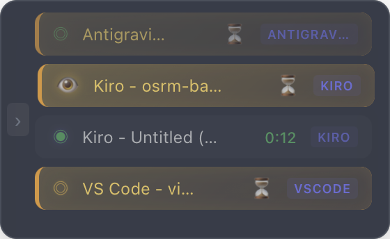
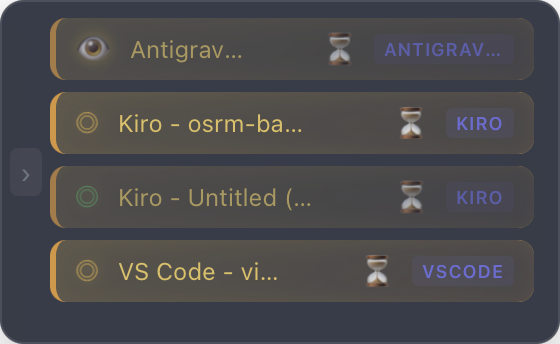

# Vibe Process Bar

<p align="center">
  <a href="README.md">English</a> | <a href="README_zh-CN.md">简体中文</a>
</p>

<p align="center">
  
</p>

<p align="center">
  <strong>Visualize AI Coding Agent's Workflow at a Glance</strong>
</p>

<p align="center">
  A desktop floating progress bar designed for AI-assisted programming, visualizing AI Agent's working status in real-time.
</p>

<p align="center">
  
  
  
</p>

---

## Why Vibe Process Bar?

When using AI coding assistants like Cursor, Kiro, or Claude, do you often face these issues?

- 🤔 **Unknown Status** — AI is thinking in the background while you wait blindly
- ⏰ **Uncertain Completion** — Lose track of progress after switching windows
- 🔄 **Multi-task Chaos** — Easy to get confused when running multiple AI tasks
- 🪟 **Window Switching Pain** — Hard to find the right IDE window among many open apps

**Vibe Process Bar** solves these problems! It is a lightweight floating window that continuously stays on top, keeping you informed of the AI's working status at all times. **Double-click any task to instantly jump to its IDE window** — no more hunting through your taskbar!

> ⚠️ **Note**: The window jump feature requires macOS Accessibility permission. Grant it in System Settings → Privacy & Security → Accessibility.

---

## 📸 Screenshots

| Running | Completed | Monitor |
|:---:|:---:|:---:|
|  |  |  |

---

## ✨ Core Features

### 🎯 Real-time Status Tracking

| Status | Icon | Meaning |
|:---:|:---:|:---|
| **Armed** | ◎ | Standing by, ready to start |
| **Running** | ◉ | AI is working, dynamic progress bar |
| **Completed** | ✓ | Task completed |
| **Focused** | 👁 | Window gained focus |

### 🖥️ Multi-IDE Support

Fully supports mainstream AI coding tools and IDEs:

- **VS Code** (including derivatives)
    - Supports all major AI plugins: GitHub Copilot, Cline, RooCode, Claude Code, etc.
- **Cursor** (Native Support)
- **Kiro** (Native Support)
- **Windsurf** (Native Support)
- **Antigravity** (Native Support)
- **Trae** (Native Support)
- **CodeBuddy / CodeBuddy CN** (Native Support)

### 🎨 Elegant Floating Design

- Translucent frosted glass effect, doesn't obstruct workspace
- Draggable to any position
- **Double-click to jump to the corresponding task window** (requires macOS Accessibility permission)
- Always on top, always visible

### 📊 Multi-task Management

- Track multiple AI tasks simultaneously
- Click to switch between different tasks
- Independent display of progress and status for each task

---

## 🚀 Quick Start

### ⚠️ Prerequisites

**You MUST install the VS Code extension for Vibe Process Bar to work properly:**

👉 **[Vibe Process Bar VS Code Extension](https://github.com/hzw456/vibeProcessBarVSCodeExt)**

The desktop app communicates with the VS Code extension to detect AI coding activity. Without the extension, the progress bar will not function.

---

### Method 1: Download Pre-built Version (Recommended)

Download from the [Releases](https://github.com/hzw456/vibeProcessBar/releases) page:

| System | Download |
|:---|:---|
| macOS (Apple Silicon) | `VibeProcessBar_x.x.x_aarch64.dmg` |
| macOS (Intel) | `VibeProcessBar_x.x.x_x64.dmg` |

### Method 2: Build from Source

```bash
# 1. Clone the repository
git clone https://github.com/hzw456/vibeProcessBar.git
cd vibeProcessBar

# 2. Install dependencies
npm install

# 3. Run in development mode
npm run tauri dev

# 4. Build for production
npm run tauri build
```

**System Requirements:**
- macOS
- Node.js 18+
- Rust 1.70+
- Tauri CLI (`npm install -D @tauri-apps/cli`)

---

## 🔌 Core Principles & Integration

Vibe Process Bar provides three flexible status detection mechanisms, adapting to different usage scenarios:

### 1️⃣ Hook Detection (Recommended)
Syncs status precisely via the IDE's own Hook mechanism.
- **Principle**: Uses IDE callbacks (like `.kirohooks` start scripts, `.cursorrules`, etc.) to automatically notify Vibe Process Bar when tasks start and end.
- **Supported Apps**: Cursor, Windsurf, Kiro, Trae, CodeBuddy, Antigravity.
- **Features**: Triggered by official or native Hook interfaces, extremely accurate.

**Hook Scripts Location**: `rules/on-agent-start.sh` and `rules/on-agent-complete.sh`

Copy these scripts to your IDE's hook configuration directory:
- **Kiro**: Copy to `.kiro/hooks/` directory
- **Cursor**: Reference in `.cursorrules` file
- **Other IDEs**: Follow their respective hook configuration methods

### 2️⃣ MCP Protocol (Recommended)
Connects directly via the Model Context Protocol standard.
- **Principle**: AI Agent actively connects to Vibe Process Bar Server via MCP Client.
- **Tools Provided**:
    - `list_tasks`: Get current active task list.
    - `update_task_status`: Report task status (running, completed, error, etc.).
- **Supported Apps**: Supports all plugins and tools compatible with MCP protocol (like Claude Desktop, Cline, RooCode, etc.).

**Important**: When using MCP, it's recommended to also use the rules in `rules/rules.md` to ensure the AI Agent properly reports status. Add the content of `rules/rules.md` to your AI assistant's system prompt or rules configuration.

**Configuration Example**:

```json
{
  "mcpServers": {
    "vibe-process-bar": {
      "url": "http://127.0.0.1:31415/mcp"
    }
  }
}
```

### 3️⃣ Plugin Reporting (Code Detection)
Analyzes code change frequency via VS Code extension.
- **Principle**: Monitors file modification speed and character changes to infer if AI is generating code.
- **Supported Plugins**: GitHub Copilot, RooCode, Cline, Claude Code, and all other AI plugins running inside VS Code.

**⚠️ Required**: You must install the [Vibe Process Bar VS Code Extension](https://github.com/hzw456/vibeProcessBarVSCodeExt) to enable this feature.

> [!WARNING]
> **Not recommended for precise tracking**
> This method is a "guess" based on code modification behavior, which is less accurate than MCP or Hook methods. Only recommended as a supplement when MCP or Hook cannot be used.

---

## 📁 Project Structure

```
vibeProcessBar/
├── docs/
│   └── images/           # Screenshots and documentation images
├── rules/
│   ├── on-agent-start.sh    # Hook script: called when AI agent starts
│   ├── on-agent-complete.sh # Hook script: called when AI agent completes
│   └── rules.md             # MCP rules for AI assistants
├── src/                  # Vue frontend source code
├── src-tauri/            # Tauri/Rust backend source code
└── ...
```

---

## 🛠️ Supported IDEs & Plugin List

For the best experience, we recommend choosing the integration method that best fits your tool:

| Tool/IDE | Recommended Method | Optimization |
|:---|:---|:---|
| **Cursor** | ✅ MCP | Recommended |
| **Windsurf** | ✅ MCP | Recommended |
| **Kiro** | ✅ HOOK | Recommended |
| **Antigravity** | ✅ MCP | Recommended |
| **Cline** | ✅ MCP | Recommended |
| **RooCode** | ✅ MCP | Recommended |
| **GitHub Copilot** |✅ MCP | Recommended |
| **VS Code** | ✅ MCP | Recommended |

**Note**: For AI assistants running in VS Code (like GitHub Copilot), you **must** install the Vibe Process Bar VS Code extension to enable status detection.

---

## ⚙️ Settings

Click the settings icon on the right side of the progress bar to configure:

- 🌐 **Language** — Support Chinese / English
- 🎨 **Theme** — System / Dark / Light
- 📍 **Position** — Remember window position
- 🔔 **Notifications** — Alert when task completes

---

## ☕ Support & Donation

If you find Vibe Process Bar helpful, consider buying me a coffee!

<a href="https://ko-fi.com/hzw456" target="_blank">
  
</a>

---

## 📄 License

This project's source code is licensed under the [GNU General Public License v3.0 (GPLv3)](https://www.gnu.org/licenses/gpl-3.0.html).

**This software is open source and free to use. Resale is strictly prohibited.**

### ⚠️ Trademark Protection

**The "Vibe Process Bar" name and Logo are NOT included in the open source license.**

- The software name "Vibe Process Bar" and associated Logo are proprietary identifiers of this project
- Use of the project name and Logo in derivative works or distributions is prohibited without written permission
- Please contact the author for authorization if needed

### You CAN:
- ✅ Freely use, modify, and distribute the source code
- ✅ Create derivative works based on this project
- ✅ Publish derivative works under GPLv3 compliance

### You CANNOT:
- ❌ Sell this software or derivative works
- ❌ Use "Vibe Process Bar" name and Logo without authorization
- ❌ Distribute modified versions as closed source

---

<p align="center">
  <strong>Make AI programming transparent, make waiting anxiety-free ✨</strong>
</p>
